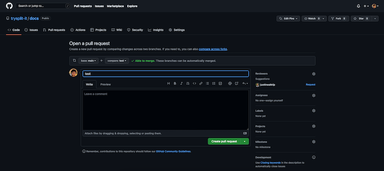

# **❗❗ WARNING: NEVER PUSH TO MAIN. ❗❗**

# How to use GitHub

This tutorial aims to catch you up to speed on using GitHub effectively for our development. Most things you pick up through practice, but if you get stuck, you can always refer to this guide.

## Terminology

- **Git** is a version control system (VCS) that was designed for handling non-linear workflows.
- **GitHub** is a hosting service that uses **Git** to allow users to collaborate, share, and develop software together.
- **Branch** is a term for a development pipeline where you *branch* out of the main version, and allows you to make changes without affecting the original.
- **Merge** is a term for when you take one branch's code and copy it into another, along with some special **Git** magic.
- **Pull Request (PR)** is a term for a request you can make on **GitHub** to automatically **merge** a branch into another.
- **Merge Conflict** is a term for when the automated system cannot account for certain changes, usually when the same line of code is changed in different ways.

## Workflow

You should already know how this works, but here's what you should do, just in case.

After you are satisfied with your changes locally, here are the things you should do (in your terminal/console):

`git add [FILENAME]`. If you changed multiple files, then `git add .` will work to add all your files at once.

`git commit -m "[YOUR MESSAGE]"`. This will commit your changes locally, with the commit message being what you choose it to be. Be descriptive.

`git push`. This will push your changes to the remote repository.

Alternatively, if you have [Visual Studio Code](https://code.visualstudio.com/), all of this can be done in a few button clicks. Up to you to decide which one is more convenient!

## Making Branches

This is the section you need to pay attention for, and will probably find yourself looking back at often.

Git allows users to create *branches* of their code, so that you can commit and push your changes without affecting anything else. This makes collaboration really easy and seamless, as we can all work independently without having to worry about writing conflicting code with other people.

### Checking your branch

When you `cd` into a repository, you can use the command:

`git branch`

Which will show you the branch you are on, and all other branches that you have on your local machine. Before you make any changes, **make sure you are on the branch you intend to change.** For your reference, **you may not directly make changes to the main branch.** If you do, you will be struck by lightning on the spot and disappear from existence.

### Switching branches

If you ever need to switch your branch, you can use the command:

`git checkout [BRANCHNAME]`

Where `[BRANCHNAME]` is the name of the branch you are switching to. For example, if I am on branch `main`, and I want to switch to my own development branch `main-kevin`, then I would simply type `git checkout main-kevin` and I will be on my branch. Simple!

### Creating new branches

This one is a bit trickier, since where you branch from is important. Our project (for web dev) will generally be structured like this:
```
main
|   -> iteration-01
|   |   -> iteration-01-frontend
|   |   |   -> iteration-01-frontend-justin
|   |   |   -> iteration-01-frontend-kevin
|   |   -> iteration-01-backend
|   |   |   -> iteration-01-backend-justin
|   |   |   -> iteration-01-backend-kevin
|   -> iteration-02
|   |   -> iteration-02-frontend
|   |   |   -> iteration-02-frontend-justin
|   |   |   -> iteration-02-frontend-kevin
|   |   -> iteration-02-backend
|   |   |   -> iteration-02-backend-justin
|   |   |   -> iteration-02-backend-kevin
|    .
|    .
|    .
```

This structure implies that `main` has two branches, `iteration-01` and `iteration-02`. Each of these branches have a `frontend` and `backend` branch, which then have each a personal branch for Justin and Kevin. As you can see, we follow a certain **naming convention**, where the name of the branch you branched out from is conserved, with a `-` delineating each branch. That is, if you are branching out from `one`, then you would name your branch `one-two`, and if you branch out from that branch, then your branch would be named `one-two-three`.

**A really important thing to note is that what branch you branch out of matters.** If you are making your branch for `iteration-03-backend`, then you *have* to first be on that branch. That is, you must first confirm your branch with `git branch`, and if you're not on the branch you intend to branch out from (`iteration-03-backend` in this case), then you *must* do `git checkout iteration-03-backend` first. Keeping best practices will avoid countless headaches later. Trust me.

## Making Pull Requests (PRs)

To make a PR, you need to be on the GitHub site. When you make a branch and commit any changes to it, you'll see a message that pops up like this:


If you don't see this pop-up, you can also create your branch manually by going into the `Pull requests` tab, clicking on `New pull request`, and selecting your branch as the *compare* branch:


Both of these options will eventually lead to this screen:



From here, **make sure you are merging to the correct branch.** The `base` branch should be the branch you are *merging to*, and the `compare` branch should be the branch you are making a request for. Once you are certain these branches are correct, add your mentor as a reviewer. Click `Create pull request`, and you are done!

# **❗❗ WARNING: NEVER PUSH TO MAIN. ❗❗**